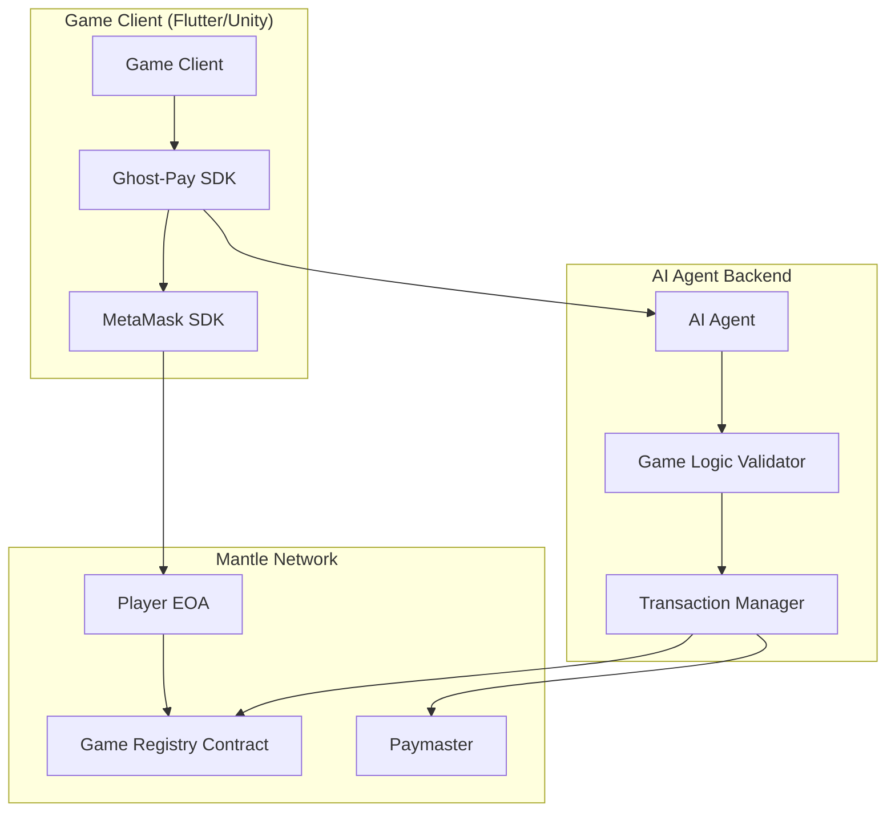

# Design Document: Ghost-Pay SDK

## Overview

Ghost-Pay SDK is a Flutter plugin that enables seamless blockchain gaming experiences through EIP-7702 delegation and AI-powered transaction management. The system eliminates traditional barriers to blockchain gaming by providing gasless, invisible transactions while maintaining security through delegated permissions.

The architecture consists of three main components:
1. **Flutter SDK** - Client-side integration for games
2. **AI Agent Backend** - Server-side transaction management and game logic
3. **Smart Contracts** - On-chain state management with Mantle Paymaster integration

## Architecture



## Components and Interfaces

### Flutter SDK Component

The Ghost-Pay SDK provides a clean interface for game developers to integrate blockchain functionality.

**Core Classes:**
```dart
class GhostPaySDK {
  Future<void> initialize(String gameId, String mantleRpcUrl);
  Future<WalletConnection> connectWallet();
  Future<DelegationAuth> requestDelegation(DelegationParams params);
  Future<void> sendGameEvent(GameEvent event);
  Stream<TransactionStatus> get transactionStream;
}

class DelegationParams {
  final BigInt spendingLimit;
  final Duration duration;
  final List<String> allowedActions;
}

class GameEvent {
  final String eventType;
  final Map<String, dynamic> data;
  final String playerId;
  final DateTime timestamp;
}
```

**Wallet Integration:**
- Uses modified web3dart library with EIP-7702 support
- Integrates MetaMask SDK for wallet connection
- Handles network switching to Mantle automatically

**Event Management:**
- Queues game events for reliable delivery
- Implements retry logic with exponential backoff
- Provides real-time status updates to game client

### AI Agent Backend Component

The backend service monitors game state and executes blockchain transactions on behalf of players.

**Core Architecture:**
```python
class AIGameAgent:
    def __init__(self, game_rules: GameRules, web3_client: Web3):
        self.game_rules = game_rules
        self.web3_client = web3_client
        self.transaction_manager = TransactionManager()
    
    async def process_game_event(self, event: GameEvent) -> TransactionResult:
        # Validate event against game rules
        # Construct appropriate blockchain transaction
        # Sign using delegated permission
        # Broadcast to Mantle network
```

**Game Logic Validation:**
- Implements configurable rule engine for different games
- Validates player actions against predefined constraints
- Prevents cheating and ensures fair gameplay
- Supports complex multi-step game scenarios

**Transaction Management:**
- Constructs transactions based on validated game events
- Signs transactions using EIP-7702 delegated permissions
- Manages nonce tracking and gas estimation
- Implements retry logic for failed transactions

### Smart Contract Component

**Game Registry Contract:**
```solidity
contract GameRegistry {
    struct PlayerState {
        uint256 level;
        uint256 experience;
        uint256[] itemIds;
        mapping(uint256 => uint256) itemQuantities;
    }
    
    mapping(address => PlayerState) public players;
    mapping(address => bool) public authorizedAgents;
    
    function mintItem(address player, uint256 itemId, uint256 quantity) 
        external onlyAuthorizedAgent {
        // Mint items to player inventory
    }
    
    function updatePlayerState(address player, uint256 newLevel, uint256 newExp) 
        external onlyAuthorizedAgent {
        // Update player progression
    }
}
```

**Paymaster Integration:**
- Implements ERC-4337 Paymaster interface
- Sponsors gas fees for authorized game transactions
- Validates transaction eligibility before sponsoring
- Tracks spending limits per player and game

## Data Models

### Player Authentication Model
```dart
class PlayerAuth {
  final String walletAddress;
  final String signature;
  final DateTime expiresAt;
  final DelegationPermissions permissions;
}

class DelegationPermissions {
  final BigInt maxSpend;
  final Duration validFor;
  final List<ContractPermission> contracts;
}
```

### Game Event Model
```dart
class GameEvent {
  final String eventId;
  final String eventType; // "boss_kill", "level_up", "item_craft"
  final String playerId;
  final Map<String, dynamic> eventData;
  final DateTime timestamp;
  final EventStatus status;
}

enum EventStatus { pending, processing, completed, failed }
```

### Transaction Model
```dart
class GameTransaction {
  final String transactionHash;
  final String eventId;
  final String contractAddress;
  final String methodName;
  final Map<String, dynamic> parameters;
  final TransactionStatus status;
  final BigInt gasUsed;
}
```

## Correctness Properties

*A property is a characteristic or behavior that should hold true across all valid executions of a system—essentially, a formal statement about what the system should do. Properties serve as the bridge between human-readable specifications and machine-verifiable correctness guarantees.*

### Property 1: Wallet Connection State Persistence
*For any* successful wallet connection, the stored wallet address and connection state should match the connected wallet's actual address and status.
**Validates: Requirements 1.2**

### Property 2: Network Validation Consistency
*For any* wallet connection attempt, the network validation should correctly identify whether the wallet is on the Mantle network.
**Validates: Requirements 1.4**

### Property 3: Authentication Data Cleanup
*For any* wallet disconnection, all previously stored authentication data should be completely cleared from local storage.
**Validates: Requirements 1.5**

### Property 4: Authorization Request Sequence
*For any* completed wallet connection, the system should automatically request EIP-7702 delegation authorization as the next step.
**Validates: Requirements 2.1**

### Property 5: Authorization Information Completeness
*For any* authorization request display, the interface should contain spending limits, duration, and permitted actions information.
**Validates: Requirements 2.2**

### Property 6: EIP-7702 Implementation Correctness
*For any* signed authorization, the EOA should be upgraded in-place without deploying any new smart account contracts.
**Validates: Requirements 2.3**

### Property 7: Signature Validation Integrity
*For any* authorization signature, the system should validate it correctly before allowing gameplay to proceed.
**Validates: Requirements 2.4**

### Property 8: Event Delivery Reliability
*For any* game event generated by the client, the AI agent should receive the event with complete and accurate details.
**Validates: Requirements 3.1**

### Property 9: Game Event Validation Consistency
*For any* game event submitted to the AI agent, the validation result should be consistent with the predefined game rules.
**Validates: Requirements 3.2**

### Property 10: Transaction Construction Correctness
*For any* validated game event, the AI agent should construct blockchain transactions that accurately represent the intended game action.
**Validates: Requirements 3.3**

### Property 11: Delegated Signing Accuracy
*For any* transaction constructed by the AI agent, the signature should be valid and created using the player's delegated permissions.
**Validates: Requirements 3.4**

### Property 12: Retry Logic Behavior
*For any* failed transaction broadcast, the AI agent should implement exponential backoff retry logic with appropriate intervals.
**Validates: Requirements 3.6**

### Property 13: Inventory State Consistency
*For any* item minting operation, the Game Registry should accurately update the player's inventory to reflect the new items.
**Validates: Requirements 4.2**

### Property 14: Smart Contract Validation Rules
*For any* state change attempt, the Game Registry should validate it against game rules and reject invalid changes.
**Validates: Requirements 4.3, 4.4**

### Property 15: Event Emission Completeness
*For any* state change in the Game Registry, appropriate events should be emitted with complete information for indexing.
**Validates: Requirements 4.5**

### Property 16: Gas Sponsorship Consistency
*For any* eligible player transaction, the Paymaster should automatically sponsor the gas fees without player intervention.
**Validates: Requirements 5.1, 5.2**

### Property 17: Transaction Eligibility Validation
*For any* transaction submitted for sponsorship, the Paymaster should correctly validate eligibility before sponsoring.
**Validates: Requirements 5.3**

### Property 18: Event Structure Consistency
*For any* significant game event, the generated event data should follow the structured format with all required fields.
**Validates: Requirements 7.1**

### Property 19: Event Deduplication Logic
*For any* duplicate game event, the AI agent should detect and prevent double-processing of the same event.
**Validates: Requirements 7.5**

### Property 20: Rate Limiting Enforcement
*For any* sequence of requests exceeding defined limits, the AI agent should enforce rate limiting to prevent abuse.
**Validates: Requirements 8.2**

### Property 21: Data Encryption Round Trip
*For any* sensitive data processed by the SDK, encrypting then decrypting should produce the original data unchanged.
**Validates: Requirements 8.4**

### Property 22: Access Control Enforcement
*For any* unauthorized modification attempt, the Game Registry should reject the operation and maintain data integrity.
**Validates: Requirements 8.5**

## Error Handling

### Client-Side Error Handling
- **Network Failures**: Implement retry logic with exponential backoff for all network operations
- **Wallet Errors**: Provide clear error messages for connection failures, wrong networks, and insufficient permissions
- **Authorization Failures**: Handle expired or invalid authorizations gracefully with re-authorization prompts
- **Transaction Failures**: Display user-friendly error messages while logging technical details for debugging

### Backend Error Handling
- **Game Event Validation Errors**: Return structured error responses with specific validation failure reasons
- **Blockchain Transaction Errors**: Implement retry logic for temporary failures and alert for permanent failures
- **Rate Limiting**: Implement graceful degradation when rate limits are exceeded
- **Security Violations**: Log security events and temporarily suspend suspicious accounts

### Smart Contract Error Handling
- **Access Control Violations**: Revert transactions with descriptive error messages
- **Invalid State Transitions**: Validate all state changes and reject invalid operations
- **Gas Limit Exceeded**: Optimize contract operations and provide gas estimation
- **Paymaster Failures**: Fallback to user-paid transactions when sponsorship fails

## Testing Strategy

### Unit Testing Approach
The testing strategy employs a dual approach combining unit tests for specific scenarios and property-based tests for comprehensive validation:

**Unit Tests Focus Areas:**
- Specific wallet connection scenarios (MetaMask, WalletConnect)
- Authorization flow edge cases (expired tokens, invalid signatures)
- Game event processing examples (boss kills, level ups, item crafting)
- Smart contract integration points
- Error handling scenarios

**Property-Based Testing Configuration:**
- **Framework**: Use fast_check for Dart/Flutter components and Hypothesis for Python backend
- **Test Iterations**: Minimum 100 iterations per property test
- **Test Tagging**: Each property test tagged with format: **Feature: ghost-pay-sdk, Property {number}: {property_text}**

### Property-Based Testing Implementation
Each correctness property will be implemented as a property-based test:

1. **Wallet and Authorization Properties (1-7)**: Test wallet connection, authorization flows, and signature validation across various wallet states and network conditions
2. **AI Agent Properties (8-12)**: Test event processing, transaction construction, and retry logic with generated game events and network conditions
3. **Smart Contract Properties (13-17)**: Test state management, validation rules, and gas sponsorship with various transaction types and player states
4. **Game Event Properties (18-19)**: Test event generation, queuing, and deduplication with various game scenarios
5. **Security Properties (20-22)**: Test rate limiting, encryption, and access controls with various attack scenarios

### Integration Testing
- **End-to-End Game Flows**: Test complete player journeys from wallet connection to reward receipt
- **Cross-Component Communication**: Verify proper data flow between Flutter SDK, AI agent, and smart contracts
- **Network Resilience**: Test system behavior under various network conditions and failures
- **Performance Testing**: Validate system performance under expected load conditions

### Security Testing
- **Authorization Security**: Test delegation permissions and signature validation
- **Transaction Security**: Verify proper access controls and rate limiting
- **Data Protection**: Test encryption and secure data handling
- **Smart Contract Security**: Audit contract code for common vulnerabilities