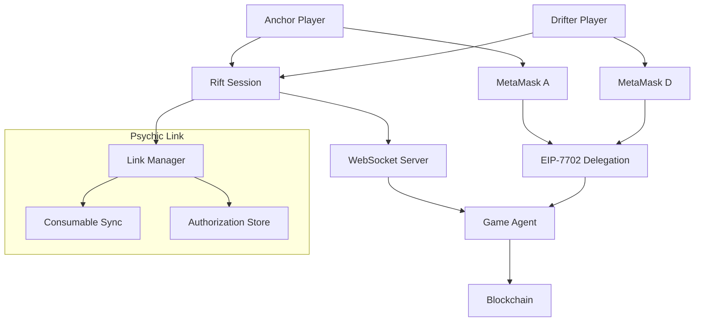

# Design Document: Psychic Link System

## Overview

The Psychic Link system creates a supernatural multiplayer experience where two players establish a bidirectional EIP-7702 delegation that allows mutual spending of consumables. This design builds upon the existing Ghost-Pay infrastructure while introducing real-time multiplayer coordination and shared resource management.

## Architecture

### High-Level Architecture



### Component Interaction Flow

1. **Session Creation**: Anchor creates rift, generates room code
2. **Player Joining**: Drifter joins using room code via WebSocket
3. **Link Initialization**: Both players authorize EIP-7702 delegation
4. **Active Gameplay**: Shared consumable pool with real-time sync
5. **Session Termination**: Automatic delegation revocation

## Components and Interfaces

### 1. Rift Session Manager

**Purpose**: Manages multiplayer session lifecycle and room codes

```typescript
interface RiftSessionManager {
  createRift(anchorAddress: string): Promise<RiftSession>
  joinRift(drifterAddress: string, roomCode: string): Promise<RiftSession>
  terminateRift(sessionId: string): Promise<void>
  getRiftStatus(sessionId: string): RiftStatus
}

interface RiftSession {
  id: string
  roomCode: string
  anchor: PlayerInfo
  drifter?: PlayerInfo
  linkStatus: LinkStatus
  createdAt: Date
  expiresAt: Date
}

enum LinkStatus {
  INACTIVE = 'inactive',
  PENDING = 'pending', 
  ACTIVE = 'active',
  BROKEN = 'broken'
}
```

### 2. Psychic Link Manager

**Purpose**: Handles EIP-7702 mutual authorization and link state

```typescript
interface PsychicLinkManager {
  initializeLink(session: RiftSession): Promise<void>
  establishLink(anchorSig: string, drifterSig: string): Promise<void>
  breakLink(sessionId: string): Promise<void>
  getLinkStatus(sessionId: string): LinkStatus
}

interface MutualDelegation {
  anchorToAgent: EIP7702Authorization
  drifterToAgent: EIP7702Authorization
  sessionId: string
  createdAt: Date
  isActive: boolean
}
```

### 3. Consumable Sync Engine

**Purpose**: Real-time synchronization of consumable inventories

```typescript
interface ConsumableSyncEngine {
  syncInventories(session: RiftSession): Promise<void>
  spendConsumable(playerId: string, itemId: string, amount: number): Promise<void>
  getSharedInventory(sessionId: string): SharedInventory
  onInventoryChange(callback: (inventory: SharedInventory) => void): void
}

interface SharedInventory {
  anchor: ConsumableInventory
  drifter: ConsumableInventory
  combined: ConsumableInventory
}
```

### 4. WebSocket Event System

**Purpose**: Real-time communication between players

```typescript
interface WebSocketEvents {
  // Session Events
  'rift:created': { roomCode: string, anchor: PlayerInfo }
  'rift:joined': { drifter: PlayerInfo }
  'rift:terminated': { reason: string }
  
  // Link Events
  'link:initialize': { message: string }
  'link:pending': { playerId: string }
  'link:established': { timestamp: Date }
  'link:broken': { reason: string }
  
  // Consumable Events
  'consumable:spent': { playerId: string, itemId: string, amount: number }
  'inventory:updated': { inventory: SharedInventory }
}
```

## Data Models

### Room Code Generation

```typescript
class RoomCodeGenerator {
  static generate(): string {
    const numbers = Math.floor(Math.random() * 900) + 100; // 100-999
    return `RIFT-${numbers}`;
  }
  
  static validate(code: string): boolean {
    return /^RIFT-\d{3}$/.test(code);
  }
}
```

### EIP-7702 Authorization Structure

```typescript
interface PsychicLinkAuthorization {
  types: {
    EIP712Domain: Array<{name: string, type: string}>
    PsychicAuthorization: Array<{name: string, type: string}>
  }
  primaryType: 'PsychicAuthorization'
  domain: {
    name: 'Psychic Link'
    version: '1'
    chainId: number
  }
  message: {
    sessionId: string
    partnerAddress: string
    gameAgent: string
    permissions: string[]
    nonce: number
    expiresAt: number
  }
}
```

### Consumable Data Model

```typescript
interface Consumable {
  id: string
  name: string
  type: ConsumableType
  cost: number
  effect: string
  icon: string
  rarity: Rarity
}

enum ConsumableType {
  POWER_UP = 'power_up',
  HEALING = 'healing',
  ATTACK_BOOST = 'attack_boost',
  DEFENSE_BOOST = 'defense_boost',
  SPECIAL_ABILITY = 'special_ability'
}

interface ConsumableInventory {
  playerId: string
  items: Map<string, number> // itemId -> quantity
  lastUpdated: Date
}
```

## Correctness Properties

*A property is a characteristic or behavior that should hold true across all valid executions of a system-essentially, a formal statement about what the system should do. Properties serve as the bridge between human-readable specifications and machine-verifiable correctness guarantees.*

<function_calls>
<invoke name="prework">
<parameter name="featureName">psychic-link

### Property 1: Room Code Uniqueness and Format
*For any* sequence of room code generations, all generated codes should follow the "RIFT-XXX" format and be unique within the active session pool
**Validates: Requirements 1.1**

### Property 2: Valid Room Code Connection
*For any* valid room code and drifter address, attempting to join should always result in successful connection to the anchor's session
**Validates: Requirements 1.3**

### Property 3: Invalid Room Code Rejection
*For any* invalid room code format or non-existent code, join attempts should always be rejected with appropriate error handling
**Validates: Requirements 1.4**

### Property 4: Two-Player Session Limit
*For any* rift session, attempting to add a third player should always be rejected while maintaining the existing two-player connection
**Validates: Requirements 1.5**

### Property 5: Mutual Authorization Initiation
*For any* rift session where both players consent to link, the EIP-7702 authorization process should always be initiated
**Validates: Requirements 2.2**

### Property 6: Single Signature Request Per Player
*For any* psychic link initialization, exactly one MetaMask signature request should be presented to each player
**Validates: Requirements 2.3**

### Property 7: Link Establishment on Dual Signatures
*For any* authorization process where both players successfully sign, the psychic link should always be established and marked as active
**Validates: Requirements 2.4**

### Property 8: Authorization Cancellation Handling
*For any* authorization process where either player cancels their signature, the entire link process should always be aborted
**Validates: Requirements 2.5**

### Property 9: Bidirectional Delegation Creation
*For any* successful psychic link establishment, both anchor-to-agent and drifter-to-agent EIP-7702 delegations should always be created
**Validates: Requirements 3.1**

### Property 10: Consumable-Only Authorization Scope
*For any* EIP-7702 authorization message, the permissions should never include access to NFTs, tokens, or non-consumable assets
**Validates: Requirements 3.2, 7.1, 7.2**

### Property 11: Game Agent Transaction Execution
*For any* consumable transaction during an active psychic link, the transaction should always be executed by the designated Game Agent wallet
**Validates: Requirements 3.3, 5.2**

### Property 12: Delegation Signature Persistence
*For any* completed authorization, the mutual delegation signatures should always be stored and retrievable during the session
**Validates: Requirements 3.4**

### Property 13: Session-Scoped Delegation Lifecycle
*For any* rift session termination, all associated delegations should always be revoked and cleared from storage
**Validates: Requirements 3.5, 6.2, 6.3**

### Property 14: Mutual Consumable Spending Access
*For any* active psychic link, either player should always be able to spend consumables from both players' inventories
**Validates: Requirements 5.1**

### Property 15: Partner Consumable Usage Logging
*For any* consumable spending action using a partner's resources, the action should always be logged in the battle logs with appropriate attribution
**Validates: Requirements 5.4**

### Property 16: Consumable Overdraft Prevention
*For any* consumable spending request, the system should never allow spending more than the available quantity in the combined inventory
**Validates: Requirements 5.5**

### Property 17: Session Termination Link Cleanup
*For any* player leaving a rift session, the psychic link should always be terminated and all delegations revoked immediately
**Validates: Requirements 6.1**

### Property 18: Fresh Authorization Requirement
*For any* new rift session, the system should never reuse authorization signatures from previous sessions
**Validates: Requirements 6.4**

### Property 19: Reconnection State Preservation
*For any* successful reconnection to an existing rift session, the previous psychic link status and authorizations should always be restored
**Validates: Requirements 6.5**

### Property 20: Emergency Link Revocation
*For any* emergency "BREAK LINK" action, all mutual delegations should always be revoked immediately and irreversibly
**Validates: Requirements 7.5**

### Property 21: Automatic Reconnection on Network Loss
*For any* network connectivity loss during an active session, the system should always attempt automatic reconnection
**Validates: Requirements 8.1**

### Property 22: Link State Restoration on Reconnection
*For any* successful reconnection after network loss, the psychic link status should always be restored to its previous state
**Validates: Requirements 8.2**

### Property 23: Signature Failure Retry Capability
*For any* MetaMask signature failure, the system should always allow retry without requiring full process restart
**Validates: Requirements 8.3**

### Property 24: Wallet Unavailability Notification
*For any* partner wallet becoming unavailable, the other player should always receive immediate notification of the status change
**Validates: Requirements 8.4**

## Error Handling

### Connection Failures
- **Network Timeout**: Automatic retry with exponential backoff
- **WebSocket Disconnection**: Attempt reconnection while preserving session state
- **MetaMask Unavailable**: Clear error message with setup instructions

### Authorization Failures
- **Signature Rejection**: Allow retry without session restart
- **Invalid Delegation**: Abort link process and notify both players
- **Expired Session**: Require fresh authorization for new session

### Consumable Transaction Failures
- **Insufficient Balance**: Prevent transaction and show available amounts
- **Network Error**: Queue transaction for retry when connection restored
- **Agent Wallet Issues**: Fallback to direct player transactions with warnings

## Testing Strategy

### Unit Testing
- Room code generation and validation logic
- EIP-7702 message construction and signing
- Consumable inventory management and synchronization
- WebSocket event handling and error recovery

### Property-Based Testing
- **Framework**: Use fast-check for TypeScript/JavaScript property testing
- **Test Configuration**: Minimum 100 iterations per property test
- **Property Test Tags**: Each test tagged with format: **Feature: psychic-link, Property {number}: {property_text}**

### Integration Testing
- End-to-end rift session lifecycle
- MetaMask integration with real wallet signatures
- WebSocket communication between multiple clients
- Blockchain transaction execution through Game Agent

### Security Testing
- Authorization scope validation (consumables only)
- Delegation revocation on session termination
- Protection against unauthorized asset access
- Session isolation and cross-contamination prevention

The testing strategy ensures both specific examples work correctly (unit tests) and universal properties hold across all inputs (property-based tests), providing comprehensive coverage of the Psychic Link system's correctness guarantees.